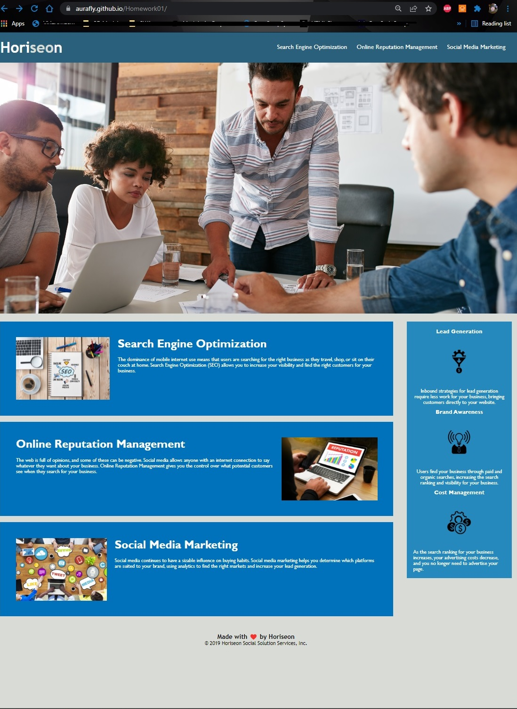

# Homework01

## First homework assignment to refactor code for Horiseon website. The goal is to  review both HTML and CSS coding and clean, fix, and consolidate where possible without changing the overall layout and style of the page.

- The motivation for myself is to demonstrate what I have learned over the last week and also build confidence by implementing what I have learned.
- Making these corrections to the site allows for the site to be more accessible and therefore more friendly to SEO and allowing for better visibility on search engines.
- During this task I learned to keep an eye out for redundant code, test frequently, and allowed me to practice what I have learned.

## Website can be viewed here:
- https://aurafly.github.io/Homework01/

    ```md
    
    ```

## Usage
- Looking at the site listed above, algit l links should function and take you directy to information that cooresponds to each specific category.

## Credits:
To whomever made the site before me, even though the code was purposely broken or messy, I did not build this site. I simply refactored.